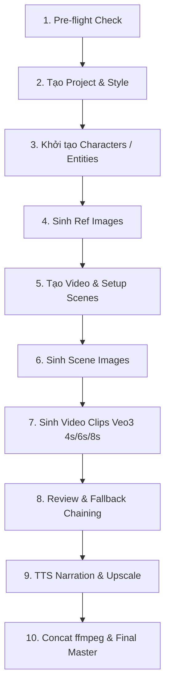

# Cẩm Nang Quy Trình Sản Xuất Video 10 Bước Chuẩn (Google Flow & Agent Veo3)

> **Dành cho:** AI Agent và Developer điều phối tự động hóa pipeline video AI trong workspace `flow-video`.  
> **Các thành phần cốt lõi:** FastAPI Backend (`:8100`), Chrome Extension MV3 (`:9222`), React Dashboard (`:5173`), Veo 3 Video Models.

---

## Sơ Đồ Tổng Quan 10 Bước (Pipeline Workflow)



---

## Chi Tiết 10 Bước Thực Chiến

### Bước 1: Pre-flight Health Check & Extension Bridge
Trước khi gửi bất kỳ yêu cầu sinh hình ảnh hay video nào, **bắt buộc** kiểm tra trạng thái kết nối của Chrome Extension:

```bash
curl -s http://127.0.0.1:8100/health
```

**Yêu cầu kết quả:**
```json
{
  "status": "ok",
  "version": "0.2.0",
  "extension_connected": true,
  "ws": { "connected": true, "active_connections": 1 }
}
```
> ⚠️ **Lưu ý:** Nếu `extension_connected: false`, hãy kiểm tra Chrome Extension trên trình duyệt và đảm bảo tab `flow.google.com` đang được mở và đăng nhập.

---

### Bước 2: Tạo Dự Án & Định Nghĩa Phong Cách (Project & Material)
Mỗi dự án cần gắn một `material` (phong cách mỹ thuật cố định) để AI giữ sự đồng nhất thị giác xuyên suốt:

```bash
curl -X POST http://127.0.0.1:8100/api/projects \
  -H "Content-Type: application/json" \
  -d '{
    "name": "Han Lang Phong Vu",
    "description": "Phim hoạt hình 3D tiên hiệp phong cách điện ảnh",
    "story": "Thiếu niên quật khởi bước vào thế giới tu tiên...",
    "material": "realistic",
    "language": "vi",
    "user_paygate_tier": "PAYGATE_TIER_TWO"
  }'
```
*Hệ thống trả về:* `project_id` (ví dụ: `proj_a1b2c3d4`).

---

### Bước 3: Định Nghĩa Nhân Vật & Thực Thể (Characters & Entities)
Khai báo nhận diện nhân vật, bối cảnh, quái thú hoặc đạo cụ:

```bash
curl -X POST http://127.0.0.1:8100/api/characters \
  -H "Content-Type: application/json" \
  -d '{
    "name": "Han Lang",
    "entity_type": "character",
    "description": "Nam thiếu niên 18 tuổi, mắt sáng kiên nghị, tóc đen buộc cao kiểu cổ trang, mặc thanh y lam sắc có thêu hoa văn chỉ bạc",
    "image_prompt": "A handsome 18-year-old Asian cultivator youth, determined sharp eyes, high ponytail black hair, wearing azure blue martial daoist robes with delicate silver embroidery, cinematic lighting, photorealistic 8k, character portrait"
  }'
```
> 💡 **Quy tắc Orientation:**
> - Nhân vật (`character`): Tỷ lệ dọc `PORTRAIT`.
> - Địa điểm / Cảnh nền (`location`): Tỷ lệ ngang `LANDSCAPE`.

---

### Bước 4: Sinh Ảnh Tham Chiếu Nhân Vật (Reference Images)
Đưa toàn bộ nhân vật vào batch để sinh ảnh gốc và thu thập `media_id` chuẩn UUID:

```bash
curl -X POST http://127.0.0.1:8100/api/requests/batch \
  -H "Content-Type: application/json" \
  -d '{
    "requests": [
      {
        "type": "GENERATE_CHARACTER_IMAGE",
        "project_id": "proj_a1b2c3d4",
        "character_id": "char_uuid_here",
        "orientation": "VERTICAL"
      }
    ]
  }'
```

**Kiểm tra hoàn tất (Polling):**
```bash
curl -s "http://127.0.0.1:8100/api/requests/batch-status?project_id=proj_a1b2c3d4"
```
> 🔴 **Quy tắc bất biến:** `media_id` nhận được **BẮT BUỘC** là UUID 36 ký tự (ví dụ: `4f7e2a91-bc34-4d82-9e20-7a8f1b2c3d4e`), không được dùng chuỗi base64 `CAMS...`.

---

### Bước 5: Tạo Video Container & Kịch Bản Phân Cảnh (Video & Scenes)

1. **Khởi tạo Video Container:**
```bash
curl -X POST http://127.0.0.1:8100/api/videos \
  -H "Content-Type: application/json" \
  -d '{
    "project_id": "proj_a1b2c3d4",
    "title": "Tap 1: Tinh Thuc Khi Hai",
    "orientation": "HORIZONTAL"
  }'
```
*Lưu lại:* `video_id` (ví dụ: `vid_98765432`).

2. **Tạo các Phân Cảnh (Scenes):**
```bash
curl -X POST http://127.0.0.1:8100/api/scenes \
  -H "Content-Type: application/json" \
  -d '{
    "video_id": "vid_98765432",
    "display_order": 1,
    "character_names": ["Han Lang"],
    "prompt": "Han Lang đứng trên vách đá nhìn mây mù cuồn cuộn nơi vực sâu, gió thổi tung vạt áo thanh y, ánh hoàng hôn chiếu rọi góc nghiêng gương mặt, góc quay toàn cảnh từ sau lưng dần chuyển sang góc nghiêng, ánh sáng điện ảnh sắc nét",
    "video_prompt": "0-3s: Han Lang stands motionless on the cliff looking at the ocean of fog, wind billowing his azure robe. 3-6s: Slow smooth cinematic camera pan from behind to side profile, revealing his determined expression. 6-8s: Golden sunset rays flare across the lens as a distant thunder rumbles.",
    "duration": 8,
    "chain_type": "ROOT"
  }'
```

---

### Bước 6: Sinh Ảnh Khởi Đầu Của Cảnh (Scene Images)
Gửi batch để sinh ảnh tĩnh làm điểm khởi đầu cho từng phân cảnh:

```bash
curl -X POST http://127.0.0.1:8100/api/requests/batch \
  -H "Content-Type: application/json" \
  -d '{
    "requests": [
      {
        "type": "GENERATE_IMAGE",
        "project_id": "proj_a1b2c3d4",
        "video_id": "vid_98765432",
        "scene_id": "scene_001",
        "orientation": "HORIZONTAL"
      }
    ]
  }'
```
> 🎯 **Quy tắc Scene Prompt:**
> - **CHỈ mô tả HÀNH ĐỘNG và ÁNH SÁNG/GÓC QUAY (ACTION ONLY)**.
> - **KHÔNG** mô tả lại màu tóc, khuôn mặt nhân vật, vì hệ thống backend đã tự động truyền `imageInputs` từ ảnh tham chiếu của nhân vật (Bước 4) để khóa diện mạo.

---

### Bước 7: Sinh Video Clip Veo 3 (4s / 6s / 8s & Sub-clip Timing)
Khi đã có `image_media_id` cho ảnh cảnh, kích hoạt sinh chuyển động video:

```bash
curl -X POST http://127.0.0.1:8100/api/requests/batch \
  -H "Content-Type: application/json" \
  -d '{
    "requests": [
      {
        "type": "GENERATE_VIDEO",
        "video_id": "vid_98765432",
        "scene_id": "scene_001",
        "duration": 8,
        "orientation": "HORIZONTAL"
      }
    ]
  }'
```

#### 📐 Cấu Trúc Sub-clip Timing Chuẩn Trong `video_prompt`:
Để video không bị biến dạng hình thể hoặc chuyển động hỗn loạn, luôn chia nhịp 2–3 giây:
```
0-3s: [Nhân vật thực hiện hành động chính, camera giữ tracking mượt mà].
3-6s: [Biến chuyển hành động thứ hai, phản ứng khuôn mặt hoặc tương tác ngoại cảnh].
6-8s: [Camera mở rộng hoặc lia góc máy kết thúc phân đoạn một cách tự nhiên].
```
Nếu có lời thoại: `Han Lang says "Con đường này, ta nhất định phải đi qua."` (tối đa 12 từ trong 3 giây).

---

### Bước 8: Đánh Giá, Tái Tạo & Fallback Chaining
- Theo dõi tiến độ sinh video qua `GET /api/requests/batch-status?video_id=vid_98765432`.
- Nếu clip sinh ra chưa đạt độ ưng ý, gọi `REGENERATE_VIDEO` (sẽ tự động dọn dẹp video cũ và sinh lại).
- **Cơ chế Degraded Chaining:** Khi nối cảnh bằng start+end frame gặp trở ngại, hệ thống Agent-Veo3 tự động kích hoạt chế độ fallback mượt sang `i2v` (Image-to-Video) từ start-frame mà không làm dừng pipeline.

---

### Bước 9: Nâng Cấp Độ Nét (Upscale) & Thuyết Minh (TTS)

1. **Sinh giọng đọc lồng tiếng (OmniVoice TTS):**
```bash
curl -X POST "http://127.0.0.1:8100/api/videos/vid_98765432/narrate" \
  -H "Content-Type: application/json" \
  -d '{
    "voice_template_id": "vietnamese_storyteller_deep",
    "speed": 1.0
  }'
```

2. **Nâng cấp độ nét (Upscale 4K / 1080p):**
```bash
curl -X POST http://127.0.0.1:8100/api/requests/batch \
  -H "Content-Type: application/json" \
  -d '{
    "requests": [
      {
        "type": "UPSCALE_VIDEO",
        "video_id": "vid_98765432",
        "scene_id": "scene_001",
        "resolution": "4K"
      }
    ]
  }'
```

---

### Bước 10: Hậu Kỳ & Ghép Nối Hoàn Chỉnh (Final Concat ffmpeg)
Hậu kỳ ghép nối các phân cảnh thành sản phẩm master hoàn chỉnh:

1. **Khử giật khung hình (Trim Overlap):**
   - Thiết lập `trim_start = 0.5s` và `trim_end = 0.5s` trên từng scene để loại bỏ các khung hình tĩnh chuyển tiếp.
2. **Ghép nối và cân bằng âm thanh:**
```bash
curl -X POST "http://127.0.0.1:8100/api/videos/vid_98765432/concat" \
  -H "Content-Type: application/json" \
  -d '{
    "music_volume": 0.25,
    "narration_volume": 1.0,
    "fade_transition_seconds": 0.5
  }'
```
Video xuất xưởng được lưu tại thư mục:
`output/<project_slug>/<video_slug>_final.mp4`

---

## Bảng Tóm Tắt Các Lệnh Thường Dùng

| Bước | Hành Động | API Endpoint | Loại Request |
|:---|:---|:---|:---|
| **01** | Kiểm tra kết nối | `GET /health` | Pre-flight |
| **02** | Khởi tạo Project | `POST /api/projects` | REST JSON |
| **03** | Khởi tạo Entity/Nhân vật | `POST /api/characters` | REST JSON |
| **04** | Sinh ảnh Ref nhân vật | `POST /api/requests/batch` | `GENERATE_REFERENCE_IMAGE` |
| **05** | Tạo Video & Scenes | `POST /api/videos` & `/api/scenes` | REST JSON |
| **06** | Sinh ảnh từng Scene | `POST /api/requests/batch` | `GENERATE_SCENE_IMAGE` |
| **07** | Sinh Video Veo3 (4s/6s/8s) | `POST /api/requests/batch` | `GENERATE_VIDEO` |
| **08** | Theo dõi trạng thái Batch | `GET /api/requests/batch-status` | Polling query |
| **09** | Lồng tiếng thuyết minh | `POST /api/videos/{vid}/narrate` | REST JSON |
| **10** | Xuất Master Video (ffmpeg) | `POST /api/videos/{vid}/concat` | Post-processing |
